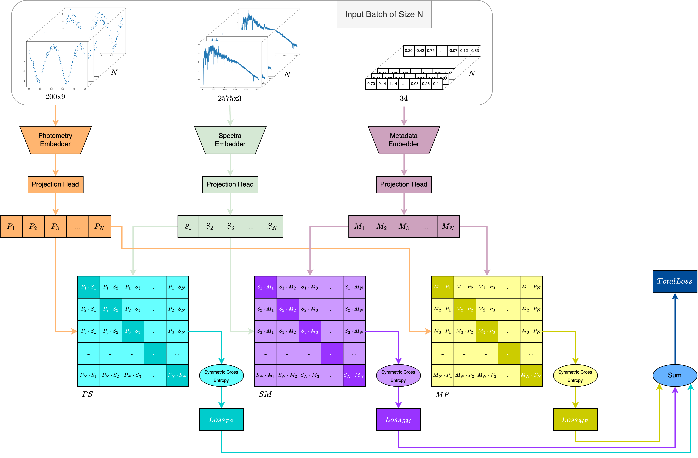

# AstroM<sup>3</sup>: A self-supervised multimodal model for astronomy


*Figure 1: Overview of the multimodal CLIP framework adapted for astronomy, incorporating three data modalities: photometric time-series, spectra, and metadata. Each modality is processed by a dedicated encoder to create embeddings, which are then mapped into a shared embedding space through projection heads. Pairwise similarity matrices align the embeddings across modalities, and a symmetric cross-entropy loss, computed over these matrices, optimizes the model. The total loss, derived from all pairwise losses, guides the model’s trimodal learning.*

## Setup

First, clone the repository and navigate to its directory:
```sh
git clone https://github.com/MeriDK/AstroM3.git
cd AstroM3
```

Create a virtual environment (tested with Python 3.10.14), then install the required dependencies:
```sh
uv venv venv --python 3.10.14
source venv/bin/activate
uv pip install -r requirements.txt
```

Login to Weights & Biases (Optional)
```sh
wandb login
```
---

## Data

AstroM3Dataset is a multimodal time-series astronomy dataset for variable star classification. It includes photometry, spectra, and metadata features and is available in two formats on Hugging Face Datasets:

1. MeriDK/AstroM3Dataset - Original data using a custom loading script.
2. MeriDK/AstroM3Processed - Preprocessed version in Parquet and Hugging Face format for faster loading.

The dataset is automatically downloaded during training, so no manual loading is required.

Each sample consists of:

- Photometry: Light curve data `(N, 3)` (time, flux, flux error).
- Spectra: Spectral observations `(M, 3)` (wavelength, flux, flux error).
- Metadata:
  - `meta_cols`: Dictionary of metadata feature names and values.
  - `photo_cols`: Dictionary of photometric feature names and values.
- Label: Class name.

### 1. MeriDK/AstroM3Dataset

This version retains the raw dataset structure and uses a custom loading script. It offers:

- Efficient storage by reusing files across different subsets and seeds.
- Suitable for exploratory data analysis (EDA) of original files.
- A longer initial load time as Hugging Face processes the dataset.

Loading:
```python
from datasets import load_dataset
dataset = load_dataset("MeriDK/AstroM3Dataset", trust_remote_code=True)
```

To load specific subsets and seeds:
```python
dataset = load_dataset("MeriDK/AstroM3Dataset", name="full_42", trust_remote_code=True)
```

To load objects with preprocessed and normalized metadata:
```python
dataset = load_dataset("MeriDK/AstroM3Dataset", name="full_42_norm", trust_remote_code=True)
```

More details: [Hugging Face](https://huggingface.co/datasets/MeriDK/AstroM3Dataset)

### 2. MeriDK/AstroM3Processed

This version contains the same data but converted into Parquet for faster access.

- **Pros**: Fast loading times.
- **Cons**: Less space-efficient due to duplicated files across subsets and seeds.
- **Usage**: Used for model training.

Loading follows the same process but does not require `trust_remote_code=True`. Specify the configuration using the format `{sub}_{random_seed}{norm}`.

- **Subset options**: `full`, `sub50`, `sub25`, `sub10`
- **Random seeds**: `42`, `0`, `66`, `12`, `123`
- **Normalization**: `""` (default) or `"_norm"`

Example:
```python
from datasets import load_dataset
dataset = load_dataset("MeriDK/AstroM3Processed", name="full_42_norm")
```

More details: [Hugging Face](https://huggingface.co/datasets/MeriDK/AstroM3Processed)

---

## Project Structure
```
AstroM3/
├── src/
│   ├── dataset.py             # Custom PyTorch dataset that processes photometry, spectra, and metadata.
│   ├── informer.py            # Includes the Informer layers
│   ├── loss.py                # Defines `CLIPLoss` for multimodal contrastive learning
│   ├── main.py                # Loads configs and setups training
│   ├── model.py               # Defines photometry (Informer), spectra (GalSpecNet), metadata (MetaModel), and multi modal (AstroM3) models
│   ├── trainer.py             # Handles training and evaluation
│   ├── utils.py               # Utility functions for model initialization, schedulers, and seed setting
├── configs/                    
│   ├── config-clip-full.yaml
│   ├── config-meta-full.yaml
│   ├── config-meta-full-clip.yaml
│   ├── config-meta-sub50.yaml
│   ├── config-meta-sub50-clip.yaml
│   ├── ...
│   ├── config-spectra-full.yaml
│   ├── config-spectra-full-clip.yaml
│   ├── ...
│   ├── config-photo-full.yaml
│   ├── ...
│   ├── config-all-full.yaml
│   ├── ...
```

#### Configurations
The `configs/` directory contains YAML configuration files structured as:
```
config-{mode}-{sub}{clip}.yaml
```
Where:
- **`mode`**: Defines the model type:
  - `clip` - Pre-training using contrastive learning.
  - `meta` - Metadata-only classification.
  - `spectra` - Spectra-only classification.
  - `photo` - Photometry-only classification.
  - `all` - Multimodal classification.
- **`sub`**: Defines the dataset size:
  - `full` - Full dataset.
  - `sub50` - 50% subset.
  - `sub25` - 25% subset.
  - `sub10` - 10% subset.
- **`clip`**: If present, the model is initialized with CLIP pre-training (`-clip`).

For example:
- `config-meta-full.yaml` - Metadata-only classification on the full dataset.
- `config-spectra-sub50-clip.yaml` - Spectra-only classification on a 50% subset using CLIP pre-training.
- `config-all-full.yaml` - Multimodal classification on the full dataset.

---

## Training and Fine-Tuning

To train or fine-tune a model, select the appropriate configuration file.

Training the CLIP model:
```sh
python src/main.py --config configs/config-clip-full.yaml
```

Fine-tuning the CLIP model on a 25% subset of spectra:
```sh
python src/main.py --config configs/config-spectra-sub25-clip.yaml
```

Fine-tuning the CLIP model on a 10% subset of multimodal classification data with a specific random seed:
```sh
python src/main.py --config configs/config-all-sub10-clip.yaml --random-seed 123
```
- The `--random-seed` argument (default: 42, possible options: 42, 0, 66, 12, 123) controls data splitting and initialization for reproducibility.

Training a model on metadata without CLIP pre-training using the full dataset:
```sh
python src/main.py --config configs/config-meta-full.yaml
```

---

## Citation
If you find this repo or data useful, please cite our paper 🤗
```
@article{rizhko2024astrom,
  title={AstroM $\^{} 3$: A self-supervised multimodal model for astronomy},
  author={Rizhko, Mariia and Bloom, Joshua S},
  journal={arXiv preprint arXiv:2411.08842},
  year={2024}
}
```
