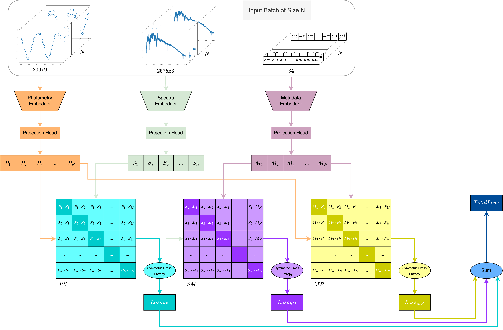

# AstroM<sup>3</sup>: A self-supervised multimodal model for astronomy


*Figure 1: Overview of the multimodal CLIP framework adapted for astronomy, incorporating three data modalities: photometric time-series, spectra, and metadata. Each modality is processed by a dedicated encoder to create embeddings, which are then mapped into a shared embedding space through projection heads. Pairwise similarity matrices align the embeddings across modalities, and a symmetric cross-entropy loss, computed over these matrices, optimizes the model. The total loss, derived from all pairwise losses, guides the model’s trimodal learning.*

## Setup

First, clone the repository and navigate to its directory:
```sh
git clone https://github.com/MeriDK/AstroM3.git
cd AstroM3
```

Create a virtual environment (tested with Python 3.10.14), then install the required dependencies:
```sh
uv venv venv --python 3.10.14
source venv/bin/activate
uv pip install -r requirements.txt
```

Login to Weights & Biases
```sh
wandb login
```
---

## Data

AstroM3 is a multimodal time-series astronomy dataset for variable star classification. It includes photometry, spectra, metadata and is available in two formats on Hugging Face Datasets:

1. AstroMLCore/AstroM3Dataset - Original data using a custom loading script.
2. AstroMLCore/AstroM3Processed - Preprocessed version ready for training.

The dataset is automatically downloaded during training, so no manual loading is required.

More details about the original dataset: [AstroMLCore/AstroM3Dataset](https://huggingface.co/datasets/AstroMLCore/AstroM3Dataset)

More details about the preprocessed dataset: [AstroMLCore/AstroM3Processed](https://huggingface.co/datasets/AstroMLCore/AstroM3Processed)

More details in the paper: [AstroM<sup>3</sup>: A self-supervised multimodal model for astronomy](https://arxiv.org/abs/2411.08842)

---

## Project Structure
```
AstroM3/
├── src/
│   ├── data.py                # Load the datasets from Hugging Face.
│   ├── informer.py            # Includes the Informer layers
│   ├── loss.py                # Defines `CLIPLoss` for multimodal contrastive learning
│   ├── main.py                # Loads configs and setups training
│   ├── model.py               # Defines photometry (Informer), spectra (GalSpecNet), metadata (MetaModel), and multi modal (AstroM3) models
│   ├── trainer.py             # Handles training and evaluation
│   ├── utils.py               # Utility functions for schedulers and seed setting
├── configs/                    
│   ├── config-clip-full.yaml
│   ├── config-meta-full.yaml
│   ├── config-meta-full-clip.yaml
│   ├── config-meta-sub50.yaml
│   ├── config-meta-sub50-clip.yaml
│   ├── ...
│   ├── config-spectra-full.yaml
│   ├── config-spectra-full-clip.yaml
│   ├── ...
│   ├── config-photo-full.yaml
│   ├── ...
│   ├── config-all-full.yaml
│   ├── ...
```

#### Configurations
The `configs/` directory contains YAML configuration files structured as:
```
config-{mode}-{sub}{clip}.yaml
```
Where:
- **`mode`**: Defines the model type:
  - `clip` - Pre-training using contrastive learning.
  - `meta` - Metadata-only classification.
  - `spectra` - Spectra-only classification.
  - `photo` - Photometry-only classification.
  - `all` - Multimodal classification.
- **`sub`**: Defines the dataset size:
  - `full` - Full dataset.
  - `sub50` - 50% subset.
  - `sub25` - 25% subset.
  - `sub10` - 10% subset.
- **`clip`**: If present, the model is initialized with CLIP pre-training (`-clip`).

For example:
- `config-meta-full.yaml` - Metadata-only classification on the full dataset.
- `config-spectra-sub50-clip.yaml` - Spectra-only classification on a 50% subset using CLIP pre-training.
- `config-all-full.yaml` - Multimodal classification on the full dataset.

---

## Training and Fine-Tuning

To train or fine-tune a model, select the appropriate configuration file.

Training the CLIP model:
```sh
python src/main.py --config configs/config-clip-full.yaml
```

Fine-tuning the CLIP model on a 25% subset of spectra:
```sh
python src/main.py --config configs/config-spectra-sub25-clip.yaml
```

Fine-tuning the CLIP model on a 10% subset of multimodal classification data with a specific random seed:
```sh
python src/main.py --config configs/config-all-sub10-clip.yaml --random-seed 123
```
- The `--random-seed` argument (default: 42, possible options: 42, 0, 66, 12, 123) controls data splitting and initialization for reproducibility.

Training a model on metadata without CLIP pre-training using the full dataset:
```sh
python src/main.py --config configs/config-meta-full.yaml
```

**Note 1:** Since subdatasets are sampled from predefined train/val/test splits, CLIP models must be pre-trained and fine-tuned using the same random seed to maintain data consistency.  

For example:  
✅ Pre-training on the full dataset with random seed `66` and fine-tuning on a 25% subset with the same seed `66` ensures proper data separation.  
❌ Pre-training on the full dataset with random seed `123` and fine-tuning on a 25% subset with seed `66` will cause data leakage, as some training samples from pre-train will end up in the validation or test set in fine-tune.

**Note 2:** After pre-training the CLIP models, update the paths in `CLIP_WEIGHTS` (located at the top of `main.py`) to the correct local directories on your machine. Otherwise, the weights will be downloaded from Hugging Face.

---

## Evaluation

You can evaluate trained models using either **Weights & Biases (W&B) runs** or **pretrained models from Hugging Face**.

To evaluate all runs across all modes, subsets, seeds, and pretraining settings:
```sh
python src/eval.py
```
**Note:** Don't forget to update `run_ids` in `eval.py` to match the IDs of your own W&B runs.

To evaluate a specific run, provide its W&B run ID:
```
python src/eval.py --run_id <wandb_run_id>
```

To evaluate all runs for a specific mode (`spectra`, `meta`, `photo`, `all`), specify:
```
python src/eval.py --mode spectra
```
You can further filter by:
- Pretraining status (`--pretrain true/false`)
- Dataset subset (`--sub sub10, sub25, sub50, full`)
- Random seed (`--seed 42, 0, 66, 12, 123`)
Example:
```
python src/eval.py --mode all --pretrain true --sub full --seed 42
```

To evaluate the models stored on Hugging Face (`pretrain=true`, `sub=full`, `seed=42`):
```
python src/eval.py --use_hf
```
The results are stored in `results.json`. To change the path specify `--res_path`.

---

## Citation
🤗 If you find this repo or data useful, please cite our paper 🤗
```
@article{rizhko2024astrom,
  title={AstroM $\^{} 3$: A self-supervised multimodal model for astronomy},
  author={Rizhko, Mariia and Bloom, Joshua S},
  journal={arXiv preprint arXiv:2411.08842},
  year={2024}
}
```
